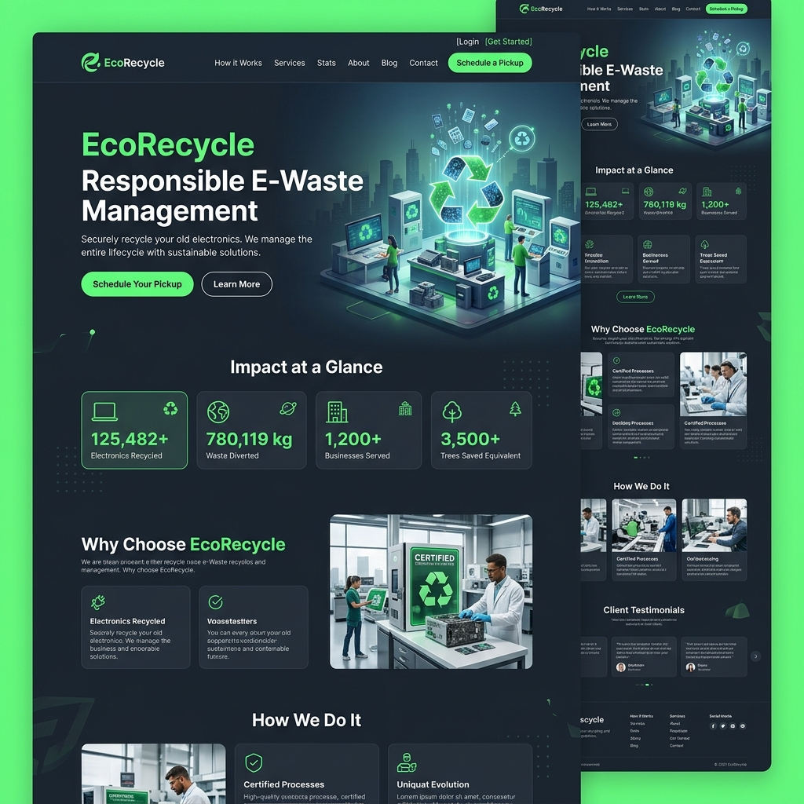
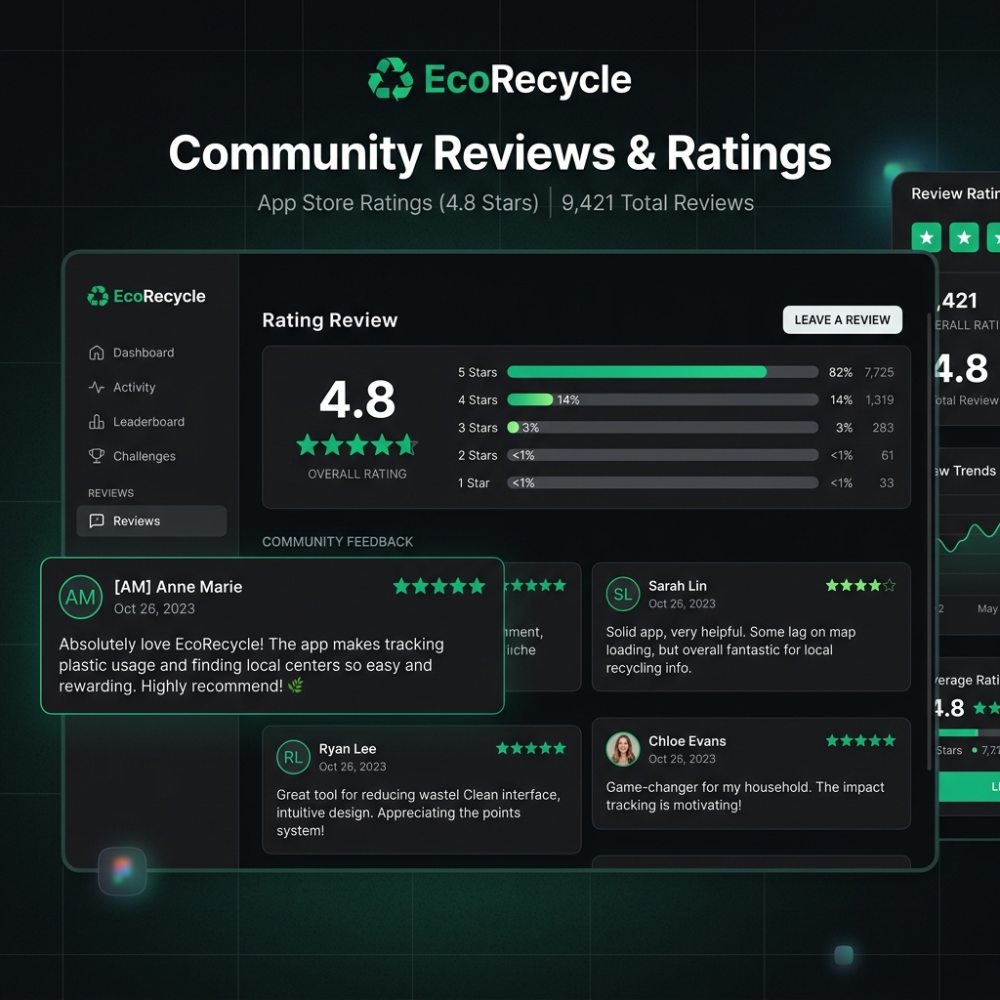
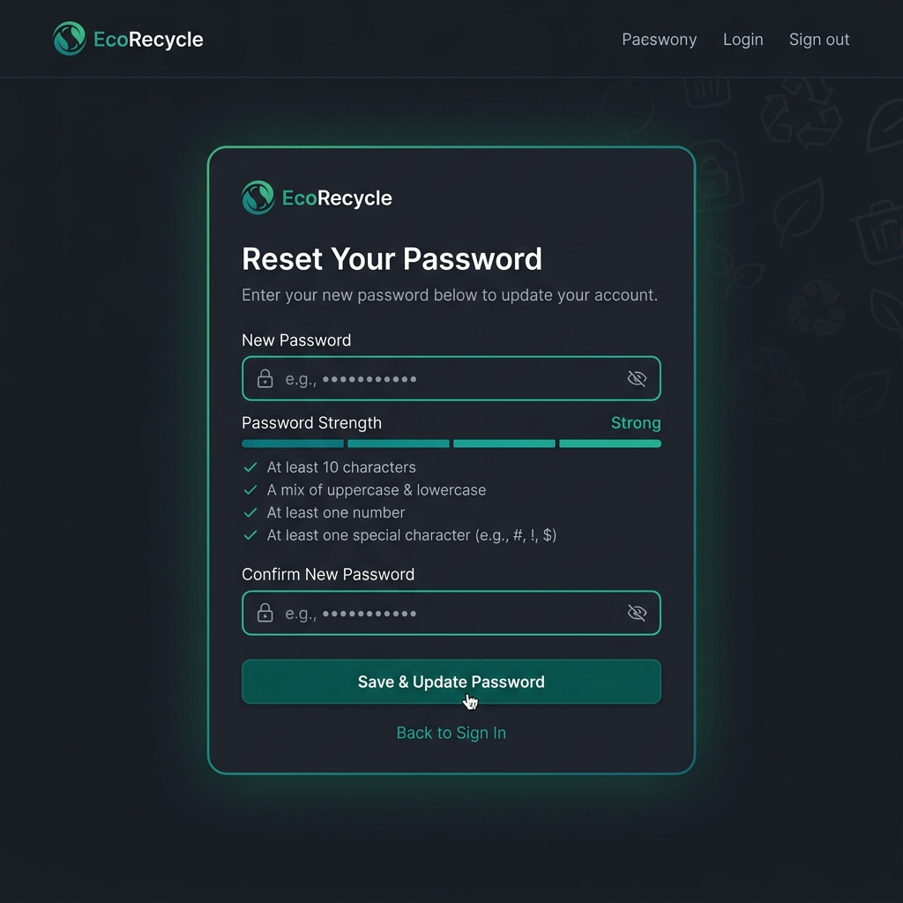
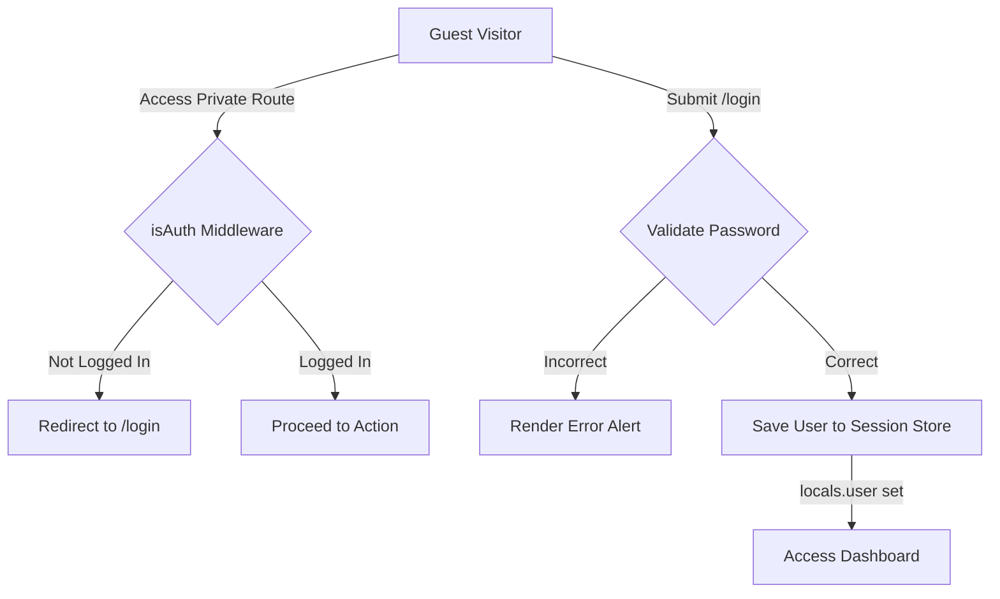

# ♻️ EcoRecycle - E-Waste Management & Recycling Platform

[](https://nodejs.org/)
[](https://expressjs.com/)
[](https://www.mongodb.com/)
[](https://getbootstrap.com/)
[](https://opensource.org/licenses/MIT)

EcoRecycle is a complete, production-ready, full-stack web application designed to combat the growing e-waste crisis. The platform enables users to coordinate electronic waste pick-ups, locate certified recycling centers, study practical reduction tips, read educational articles, and track their recycling impact dynamically via personalized dashboards.

Featuring secure session-based authentication, a global Light/Dark mode toggler, Mongoose query buffering, SHA-256 password recovery tokens, and a robust MVC architectural pattern, EcoRecycle serves as an impressive, recruiters-ready showcase project.

---

## 📋 Table of Contents
- [Features](#features)
- [Tech Stack](#tech-stack)
- [Project Structure](#project-structure)
- [Screenshots](#screenshots)
- [Installation](#installation)
- [Environment Variables](#environment-variables)
- [API Endpoints](#api-endpoints)
- [Authentication Flow](#authentication-flow)
- [Database Schema Overview](#database-schema-overview)
- [Usage](#usage)
- [Error Handling](#error-handling)
- [Security Features](#security-features)
- [Future Improvements](#future-improvements)
- [Contributing](#contributing)
- [License](#license)
- [Author](#author)

---

## 🌟 Features

- 👤 **Secure User Authentication**: Full user signup, login, and logout lifecycles powered by session-based authentication, `bcrypt` password hashing, and route protection.
- 🔑 **Google OAuth 2.0 Sign-In**: Seamless authentication supporting Google Sign-Up, Google Login, returning user login, and automated existing account linking (using email matches) with safe unique username generation.
- 🖼️ **Dynamic Avatar Rendering**: Displays user's Google profile image dynamically in the navbar, dashboard card, community reviews timeline, and profile page, falling back to name initials.
- 👤 **Account Details Profile**: Renders a dedicated `/profile` card detail page showing contact information, address details, and connection status (Google Connected badge vs. Local Password).
- 🌓 **System-Wide Theme Switcher**: A global Light/Dark mode toggler with smooth transition curves, `localStorage` state persistence, and blocker scripts to prevent page-load flash.
- 📊 **Dynamic User Dashboard**: Displays live user recycling statistics (Pickups Booked, Items Recycled, CO₂ Saved, Reward Points) and tracks scheduled pickup details.
- 🗓️ **E-Waste Pickup Scheduler**: A multi-step form validator interface enabling authenticated users to schedule pickups for custom electronic items.
- 📍 **Recycling Center Locator**: Profiling collection sites displaying operating hours, contacts, and accepted electronics lists.
- 🎓 **Educational Hub**:
  - **Articles**: Capsule-style category filters, dynamic read-times, and full content views.
  - **Videos**: Responsive video library with empty-state indicators and embedded modal popups.
  - **Facts & Tips**: Interactive progress lists detailing citation quotes.
- 💬 **Community Reviews Section**: A review board featuring rating breakdown progress bars, star icons, and ownership validations so members can add, edit, or delete comments.
- 🔑 **Cryptographic Password Recovery**: A fully secure Forgot/Reset password system storing hashed SHA-256 reset tokens in MongoDB with strict expiration timers.

---

## 🛠️ Tech Stack

| Layer | Technologies |
|---|---|
| **Frontend** | EJS (Embedded JavaScript), HTML5, Vanilla CSS, Bootstrap 5, Font Awesome v6 |
| **Backend** | Node.js, Express.js |
| **Database** | MongoDB, Mongoose ODM |
| **Authentication** | Session-Based, `bcrypt` (12 rounds) |
| **API Services** | Cryptographic token generators, local simulation logs |
| **Tools** | Nodemon, dotenv, Joi / custom validators |

---

## 📂 Project Structure

```
-EcoRecycle/
├── config/             # Configuration modules
│   └── db.js           # MongoDB connection with query buffering options
├── controllers/        # MVC Controllers (Business logic layers)
│   ├── authController.js       # Login, Signup, Forgot & Reset Password
│   ├── educationController.js  # Articles, educational facts, and videos EJS views
│   ├── mainController.js       # Homepage, about page, and dashboard statistics
│   ├── recyclingController.js  # Center directories & pickup schedulers
│   └── reviewController.js     # User reviews CRUD with aggregate calculators
├── middleware/         # Custom Express middlewares
│   └── auth.js         # Authentication guards (isAuth, isGuest)
├── models/             # Mongoose Schemas (Data Layer)
│   ├── Pickup.js       # Pickup schedule details & status schema
│   ├── Review.js       # User review text & ratings schema
│   └── User.js         # User profiles, hashes & reset tokens schema
├── public/             # Static frontend assets
│   ├── css/            # Custom themes, glassmorphism, & scrollbars
│   ├── js/             # Password eye-toggles, alerts & theme switchers
│   └── images/         # Brand logo, icons, and illustrations
├── routes/             # Express Router configurations
│   ├── education.js    # Routes for articles, tips, and videos
│   ├── index.js        # Auth, Dashboard, and Review routes
│   └── recycling.js    # Routes for center locators and pickups
├── utils/              # Shared utility helpers (CommonJS)
│   ├── ApiError.js     # Standardized API error handling class
│   ├── ApiResponse.js  # Standardized API response format constructor
│   └── asyncHandler.js # Wrapper to eliminate try-catch block repetitions
├── views/              # EJS Templates (View Layer)
│   ├── pages/          # Individual screen content templates (login, reviews)
│   └── partials/       # Reusable layout fragments (headers, footers)
├── app.js              # Express app bootstrap & global middleware declarations
├── package.json        # Dependencies & startup script configurations
└── README.md           # Documentation
```

---

## 📸 Screenshots

### Home Page

*Modern hero portal displaying recycling call-to-actions, stats indicators, and theme controls.*

### User Dashboard

*Personalized panel displaying booked pickup records, confirmation statuses, and impact cards.*

### Community Reviews

*Responsive review board displaying average rating scorecards, star filters, and text comment fields.*

### Reset Password View

*Card interface featuring validation cues, submit spinner loaders, and show/hide toggles.*

---

## ⚙️ Installation

To set up and run EcoRecycle locally, follow these steps:

1. **Clone the Repository**:
   ```bash
   git clone https://github.com/Sanesh764/-EcoRecycle.git
   cd -EcoRecycle
   ```

2. **Install Dependencies**:
   ```bash
   npm install
   ```

3. **Configure Environment File**:
   Create a `.env` file in the root directory:
   ```env
   PORT=3000
   MONGODB_URI=mongodb://localhost:27017/e-waste-management
   SESSION_SECRET=your_production_secret_key_here
   ```

4. **Start MongoDB**:
   Ensure your local MongoDB daemon is active:
   ```bash
   # Windows Command
   net start MongoDB
   ```

5. **Run the Application**:
   - For production environments:
     ```bash
     npm start
     ```
   - For hot-reloading development server:
     ```bash
     npm run dev
     ```

6. **Access App**:
   Navigate to [http://localhost:3000](http://localhost:3000) in your web browser.

---

## 🔑 Environment Variables

A `.env.example` file is included. Create a `.env` in the root folder with:

- `PORT`: Port the node server binds to. *(Default: `3000`)*
- `MONGODB_URI`: Connection string to your local or Atlas MongoDB cluster.
- `SESSION_SECRET`: Cryptographic key used to sign Express session cookies.
- `GOOGLE_CLIENT_ID`: Google OAuth 2.0 client ID from Google API Console.
- `GOOGLE_CLIENT_SECRET`: Google OAuth 2.0 client secret.
- `GOOGLE_REDIRECT_URI`: Registered redirect callback URI (e.g. `http://localhost:3000/google/callback`).

---

## 🛣️ API Endpoints

### Authentication & Account
| Method | Route | Description | Access |
|---|---|---|---|
| **GET** | `/login` | Renders Login screen | Public (Guest only) |
| **POST** | `/login` | Validates credentials and initializes session | Public (Guest only) |
| **GET** | `/register` | Renders User Registration form | Public (Guest only) |
| **POST** | `/register` | Encrypts password and creates new profile | Public (Guest only) |
| **GET** | `/auth/google` | Redirects user to Google OAuth 2.0 consent page | Public (Guest only) |
| **GET** | `/google/callback` | Exchanges code, queries Google profile, links/creates user, logs session | Public |
| **GET** | `/logout` | Destroys active user session | Private (Auth required) |
| **GET** | `/dashboard` | User dashboard detailing pickup logs & stats | Private (Auth required) |
| **GET** | `/profile` | Displays user details, avatar, and Google connection status | Private (Auth required) |

### Password Recovery
| Method | Route | Description | Access |
|---|---|---|---|
| **GET** | `/forgot-password` | Renders Forgot Password form | Public |
| **POST** | `/forgot-password` | Dispatches reset token & writes hashed token to DB | Public |
| **GET** | `/reset-password/:token` | Verifies token & renders password update form | Public |
| **POST** | `/reset-password/:token` | Validates token, hashes new password, & updates DB | Public |

### Recycling Services
| Method | Route | Description | Access |
|---|---|---|---|
| **GET** | `/recycling` | Informative recycling guidelines page | Public |
| **GET** | `/recycling/centers` | Directories of local collection sites | Public |
| **GET** | `/recycling/centers/:id` | Specific profile view of a center | Public |
| **GET** | `/recycling/pickup` | Pickup scheduling form | Private (Auth required) |
| **POST** | `/recycling/pickup` | Saves pickup booking details | Private (Auth required) |

### Reviews Board
| Method | Route | Description | Access |
|---|---|---|---|
| **GET** | `/reviews` | Displays review board, stats, and write forms | Public |
| **POST** | `/reviews` | Saves new rating & comment | Private (Auth required) |
| **GET** | `/reviews/:id/edit` | Renders edit form for a review | Private (Owner only) |
| **POST** | `/reviews/:id/edit` | Updates rating & text in database | Private (Owner only) |
| **POST** | `/reviews/:id/delete` | Removes review record from database | Private (Owner only) |

---

## 🔒 Authentication Flow

EcoRecycle uses a secure session-based authentication flow with route-guarding middlewares:



- **Session Guards**: `isAuth` blocks guests from scheduling pickups or reviews, redirecting them to `/login`. `isGuest` blocks signed-in users from seeing authentication forms, redirecting them to `/dashboard`.
- **Hashed Credentials**: Passwords are encrypted before database insertion using `bcrypt` with 12 salt rounds, rendering them unreadable in the event of an exploit.
- **Recoveries**: Generates a secure, 32-byte hexadecimal random token via `crypto.randomBytes(32)`. The database only stores the SHA-256 hashed token (`resetPasswordToken`) with a 10-minute expiry (`resetPasswordExpire`), defending against token theft.

---

## 🗄️ Database Schema Overview

### User Model
Holds credentials, address details, and recovery parameters:
```javascript
const userSchema = new mongoose.Schema({
    username: { type: String, required: true, unique: true },
    firstName: { type: String, required: true },
    lastName: { type: String, required: true },
    email: { type: String, required: true, unique: true },
    password: { type: String, required: function() { return !this.googleId; } },
    phone: String,
    address: String,
    city: String,
    state: String,
    zip: String,
    resetPasswordToken: String,
    resetPasswordExpire: Date,
    googleId: { type: String, unique: true, sparse: true },
    profilePicture: String
});
```

### Pickup Model
Holds pickup scheduling details and links to the booking user:
```javascript
const pickupSchema = new mongoose.Schema({
    user: { type: mongoose.Schema.Types.ObjectId, ref: 'User' },
    firstName: { type: String, required: true },
    lastName: { type: String, required: true },
    email: { type: String, required: true },
    phone: { type: String, required: true },
    address: { type: String, required: true },
    city: { type: String, required: true },
    state: { type: String, required: true },
    zip: { type: String, required: true },
    items: [{ type: String, required: true }],
    pickupDate: { type: Date, required: true },
    pickupTime: { type: String, required: true },
    status: { type: String, enum: ['Pending', 'Confirmed', 'Completed', 'Cancelled'], default: 'Pending' }
});
```

### Review Model
Holds user review text, scores, and links to the posting member:
```javascript
const reviewSchema = new mongoose.Schema({
    user: { type: mongoose.Schema.Types.ObjectId, ref: 'User', required: true },
    rating: { type: Number, required: true, min: 1, max: 5 },
    comment: { type: String, required: true }
});
```

---

## 💻 Usage

1. **Signup/Login**: Register an account at `/register` or sign in at `/login`.
2. **Dashboard**: Navigate to your dashboard to review your stats cards and scheduled pickups.
3. **Locate Center**: View listings of centers at `/recycling/centers` and click detail pages.
4. **Book Pickup**: Navigate to `/recycling/pickup`, check the items you wish to recycle, select a date, and submit.
5. **Rate & Review**: Visit `/reviews` to read ratings, submit a new review, or edit/delete your past submissions.
6. **Recovery**: If you lose access, visit `/forgot-password`, enter your email, retrieve the logged token from the server console, and input a new password at the link.

---

## 🛡️ Error Handling

EcoRecycle uses a unified, hierarchical error-handling structure:
- **Express Async Wrapper**: All controllers utilize `asyncHandler` which catches runtime errors inside asynchronous route callbacks and passes them to the next handler (`next(err)`).
- **ApiError Class**: Standardizes custom operational exceptions by capturing stack traces, status codes, and message parameters.
- **Global Middleware**: Caught errors trigger the unhandled exceptions middleware in `app.js` which automatically renders the custom [error.ejs](file:///c:/Users/ASUS/OneDrive/Documents/Desktop/project_web%20dev/-EcoRecycle/views/pages/error.ejs) template showing the status code (e.g. 403, 404, 500) and details.

---

## 🔒 Security Features

1. **Bcrypt Encryption**: Hashing with 12 salt rounds shields credentials.
2. **User Enumeration Shielding**: Password recovery does not leak user existences, keeping inputs generic.
3. **Cryptographic Reset Tokens**: Generates 32-byte tokens (`crypto.randomBytes`) and stores them hashed (`sha256`), preventing token reuse.
4. **Route Guards**: `isAuth` and `isGuest` protect private and public endpoints.
5. **No Parameter Flashing**: blocking `<head>` scripts check `localStorage` immediately, defending the frontend against page flashing.

---

## 🚀 Future Improvements

- [ ] **Live Mapbox Integration**: Render active collection points on interactive maps.
- [ ] **Coupons & Rewards Shop**: Allow users to spend points on green-coupons.
- [ ] **Image Upload Support**: Enable users to upload pictures of their items using Multer and Cloudinary.
- [ ] **Real-time Notifications**: Add user feedback alerts for pickups.

---

## 🤝 Contributing

Contributions are welcome! Please follow these guidelines:
1. **Fork** the repository.
2. Create a branch:
   ```bash
   git checkout -b feature/awesome-feature
   ```
3. Commit with clear statements:
   ```bash
   git commit -m "feat: add coupons module"
   ```
4. Push to your fork and open a **Pull Request**.

---

## 📄 License

This project is licensed under the **MIT License** - see the [LICENSE](LICENSE) file for details.

---

## 👨‍💻 Author

- **Name**: Sanesh Kumar
- **Role**: Computer Science Engineering Student
- **Skills**: C++, JavaScript, Node.js, Express.js, MongoDB, Mongoose, DSA
- **GitHub**: [@Sanesh764](https://github.com/Sanesh764)
- **LinkedIn**: [Sanesh Kumar](https://linkedin.com)
- **Portfolio**: [sanesh.dev](https://sanesh.dev)